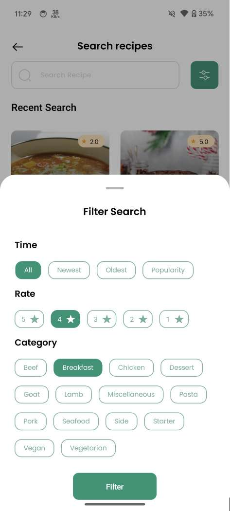

# FoodRecipeApp

Embark on a delightful culinary adventure with the FoodRecipeApp! Designed to cater to every cooking
enthusiast, our app offers a comprehensive array of features to elevate your gastronomic experience.
Dive into the vibrant world of cooking and culinary delights with the following exceptional
features:

## **Features**

1. **Authentication** 📝
    - Sign up and log in using email/password or seamlessly authenticate using social media accounts
      like Google or Facebook.

2. **Search Functionality** 🔍
    - Utilize the powerful search functionality to find recipes by keywords, ingredients, or
      categories.
    - Apply filters such as cuisine type, dietary preferences, or cooking time to refine your search
      results.

3. **Explore Recipes** 🌍
    - Embark on a culinary journey by exploring a vast collection of recipes from around the world.
    - Browse recipes categorized by country of origin, allowing you to discover new flavors and
      cuisines.

4. **Saved Recipes** 📌
    - Save your favorite recipes with just a tap of a button for easy access later.
    - Organize your saved recipes into personalized collections for convenient browsing.

5. **Create New Recipe** 📝
    - Showcase your culinary skills by posting your own recipes to the app.
    - Include detailed instructions, ingredient lists, and captivating images to share your
      creations with the community.

6. **Notification Management** 🛎️
    - Stay informed with notifications for new recipes, comments, likes, and other interactions.
    - Customize notification preferences to ensure you receive updates tailored to your interests.

7. **Profile Section** 👤
    - Personalize your profile with a photo and bio to let others know more about you.
    - View and manage your posted recipes, reviews, and other profile settings.

8. **Recipe Details** 🍲
    - Dive into the details of each recipe with comprehensive information including ingredients,
      cooking instructions, serving sizes, and more.
    - Access nutritional information, cooking tips, and variations to suit your preferences.

9. **Review and Rating** ⭐
    - Share your culinary experiences by rating and reviewing recipes.
    - Help others discover top-rated recipes and provide valuable feedback to recipe creators.

10. **Share Recipe** 📲
    - Spread the joy of cooking by sharing your favorite recipes with friends, family, and fellow
      food enthusiasts.
    - Share recipes effortlessly via social media platforms, messaging apps, or email.

These features combine to create a rich and engaging culinary experience, empowering users to
explore, create, and share delicious recipes with ease.

## **Prerequisites**

Before using the app, make sure you have the following:

1. **Internet Access**:
    - Ensure you have an active internet connection to access online sources and download books.

Certainly! Here's a simplified version of the API usage section:

## **API Usage**

FoodRecipeApp utilizes the following API:

1. **TheMealDB API**:
    - **API Endpoint**: [https://www.themealdb.com/api.php](https://www.themealdb.com/api.php)
    - **Description**: Provides access to a vast collection of meal recipes, including ingredients,
      instructions, and images.

Integrating TheMealDB API into FoodRecipeApp enhances the app's functionality by offering a diverse
range of meal recipes from around the world.

## **Setup**

Follow these steps to set up the FoodRecipeApp App:

1. **Clone the Repository**:
    - Clone the repository from [GitHub](https://gitlab.com/priyanka.makwana/foodrecipeblog.git).

2. **Open in Android Studio**:
    - Open the project in Android Studio.

3. **Build and Run**:
    - Build and run the app on an Android emulator or device.

## **Usage**

To make the most out of FoodRecipeApp, follow these simple steps:

1. **Sign Up/Login:**
    - Create an account by signing up with your email/password or log in using your Google or
      Facebook account.

2. **Explore Recipes:**
    - Use the Home screen to discover recipes categorized by country of origin.
    - Navigate to the Search screen to find specific recipes by keywords, ingredients, or
      categories.

3. **Save Favorites:**
    - Save your favorite recipes by tapping the "Save" button on the recipe details page.
    - Access your saved recipes anytime from the Saved Recipes section in the bottom navigation bar.

4. **Post Your Own Recipe:**
    - Share your culinary creations with the community by tapping the "Create Recipe" tab in the
      bottom navigation bar.
    - Provide detailed instructions, ingredient lists, and captivating images to showcase your
      recipe.

5. **Engage with the Community:**
    - Interact with other users by rating, reviewing, and sharing recipes.
    - Participate in discussions and cooking challenges in the community forum.

6. **Stay Updated:**
    - Receive notifications for new recipes, comments, likes, and interactions.
    - Customize notification settings to suit your preferences.

7. **Discover More Features:**
    - Explore additional features such as recipe details, ingredient lists, cooking tips, and
      nutritional information.
    - Share recipes with friends and family via social media, messaging apps, or email.

Enjoy your culinary journey with FoodRecipeApp! Whether you're a seasoned chef or a novice cook,
there's something for everyone to discover and enjoy. Happy cooking! 🍳🥗🍰

## **Notes**

- **Internet Connection**: FoodRecipeApp requires an active internet connection to access recipes,
  notifications, and community features. Make sure your device is connected to the internet to enjoy
  the full functionality of the app.

- **Data Usage**: Continuous use of the app may consume data, especially when browsing recipes with
  images and videos. Consider using Wi-Fi or monitoring your data usage if you have limited data
  plans.

- **Enjoy Exploring**: FoodRecipeApp is designed to inspire and empower you on your culinary
  journey. Take your time to explore recipes, share your creations, and connect with fellow food
  enthusiasts.

Feel free to reach out with any feedback or suggestions.

## **Download Apk**

Download Apk from [Here](APK/FoodRecipe_1.0_14_02.apk)

## **Screenshots**

